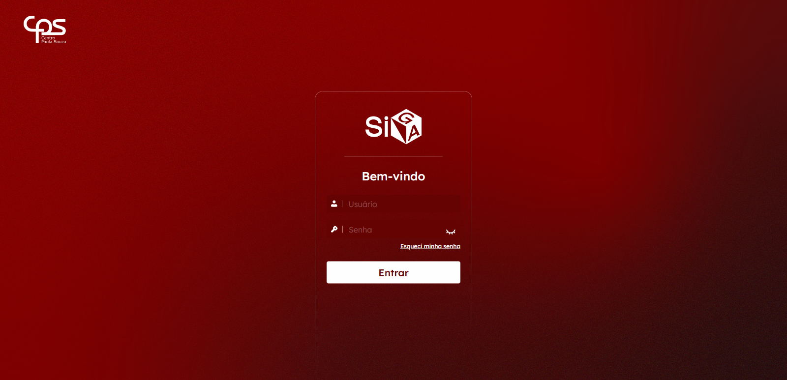
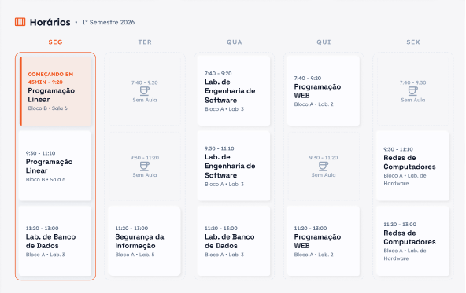

# 🚀 Siga v2

---

## 🔗 Links Úteis

* **[Repositório no GitHub](https://github.com/G4briel2/versionamento-deploy)** 
* **Deploy na Vercel**

---

## 📸 Demonstração

Abaixo estão algumas capturas de tela da interface e das funcionalidades principais:

### Tela de login

*Legenda: Tela de login básica (ex: Dashboard principal).*

### Dashboard
.png)
| Principais informações do aluno | Horários de aula |
| :---: | :---: |
|  |  |

---
